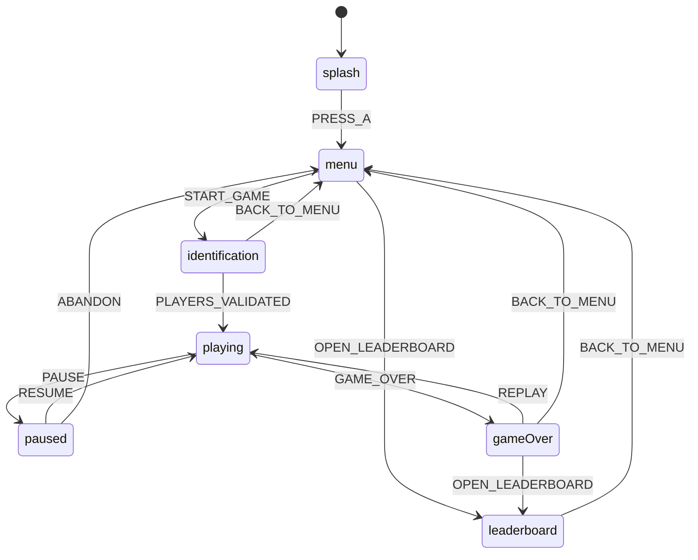

# State machine du jeu

> Source de vérité pour les transitions d'écrans et le contexte de partie.
> Implémentée dans `src/core/gameMachine.ts` + `src/core/gameStore.ts`.
> Lié à l'issue [#80](https://github.com/fouuuadi/Flipper_front/issues/80).

---

## Pourquoi

L'app `playfield` orchestre 7 écrans (splash, menu, identification, partie, pause, fin, leaderboard) avec des modes (solo / 1v1), un score, des joueurs, et bientôt du WebSocket.

Sans cette machine, on dérive vers :

- des booléens d'état parallèles (`isPaused`, `isGameOver`)
- des conditions imbriquées dans `main.ts`
- du contexte dupliqué entre composants
- des transitions impossibles à raisonner

La machine **garantit** : un seul état actif, un seul contexte, des transitions explicites et testables.

---

## Diagramme



---

## États

| État              | Quand                                      | Composant correspondant     |
| ----------------- | ------------------------------------------ | --------------------------- |
| `splash`          | Lancement de l'app (état initial)          | `src/modules/splash/`        |
| `menu`            | Menu principal après PRESS A               | `src/modules/menu/` *(à venir)* |
| `identification`  | Saisie pseudo + mode (solo / 1v1)          | `src/modules/identification/` *(à venir)* |
| `playing`         | Partie en cours, physique active           | `src/modules/playfield/` (3D)   |
| `paused`          | Pause overlay, physique gelée              | `src/modules/pause/` *(à venir)* |
| `gameOver`        | Fin de partie, récap + actions             | `src/modules/gameOver/` *(à venir)* |
| `leaderboard`     | Classement solo / 1v1                      | `src/modules/leaderboard/` *(à venir)* |

---

## Events

| Event                | Émetteur typique             | Effet                                        |
| -------------------- | ---------------------------- | -------------------------------------------- |
| `PRESS_A`            | Splash (clavier A/Enter/Space) | `splash → menu`                              |
| `START_GAME`         | Menu (bouton Jouer)          | `menu → identification`                      |
| `PLAYERS_VALIDATED`  | Identification (submit)      | `identification → playing`, init du contexte (mode, joueurs, balles) |
| `PAUSE`              | Playfield (touche Échap)     | `playing → paused`                           |
| `RESUME`             | Pause overlay                | `paused → playing`                           |
| `ABANDON`            | Pause overlay                | `paused → menu`, reset du contexte           |
| `GAME_OVER`          | Logique de partie            | `playing → gameOver`                         |
| `OPEN_LEADERBOARD`   | Menu / GameOver              | `* → leaderboard`                            |
| `BACK_TO_MENU`       | Leaderboard / GameOver / Identification | `* → menu`, reset du contexte     |
| `REPLAY`             | GameOver (bouton Rejouer)    | `gameOver → playing` avec mêmes joueurs        |

---

## Contexte porté

```ts
interface GameContext {
  mode: GameMode | null;        // "solo" | "1v1"
  players: Player[];            // pseudo + score + balles restantes
  currentBall: number;          // index de la balle en cours (1, 2, 3…)
  startedAt: number | null;     // timestamp début partie (epoch ms)
}
```

- **`mode`** : null en `menu` / `splash`, défini dès `PLAYERS_VALIDATED`.
- **`players`** : 1 entrée en solo, 2 en 1v1. Chaque joueur a son score et ses balles.
- **`currentBall`** : reset à 1 à chaque nouvelle partie ou `REPLAY`.
- **`startedAt`** : utilisé pour calculer la durée de partie au game over.

---

## API

### Store réactif singleton (`src/core/gameStore.ts`)

```ts
import { gameStore } from "@core";

// Lire l'état courant
const { value, context } = gameStore.getState();

// Émettre un event
gameStore.send({ type: "PRESS_A" });
gameStore.send({
  type: "PLAYERS_VALIDATED",
  mode: "solo",
  players: ["fouad#1234"],
});

// S'abonner aux changements (le listener est appelé immédiatement avec l'état courant)
const unsubscribe = gameStore.subscribe(({ value, context }) => {
  console.log("State:", value, "Context:", context);
});

// Désabonner quand on n'a plus besoin
unsubscribe();
```

### Pour les tests : factory isolée

```ts
import { createGameStore } from "@core";

const store = createGameStore();
// instance fraîche, indépendante du singleton
```

---

## Garde-fous

- **Transitions interdites bloquées** : `gameStore.send(event)` ignore silencieusement les events non autorisés pour l'état courant. En mode dev, un `console.warn` signale l'event ignoré.
- **Aucune mutation directe** du contexte depuis l'extérieur : passer obligatoirement par un event.
- **Aucune nouvelle transition** ne doit être ajoutée sans tester aussi le cas "interdit" (cf. `gameMachine.test.ts`).

---

## Tester

```bash
npm test            # run unique
npm run test:watch  # mode watch
```

Les tests vivent dans `src/core/gameMachine.test.ts`. Ils couvrent :

- toutes les transitions valides (chemin nominal)
- tous les events invalides depuis `splash` (garde anti-spaghetti)
- la mutation correcte du contexte sur `PLAYERS_VALIDATED`, `REPLAY`, `ABANDON`, `BACK_TO_MENU`

---

## Ne PAS faire

- ❌ Ajouter un booléen `isXxx` dans un composant pour pister un sous-état → c'est un nouveau state dans la machine
- ❌ Modifier `context.score` directement depuis un composant → passer par un event (à définir si besoin)
- ❌ Appeler `transition()` directement depuis un composant → toujours passer par `gameStore.send()`
- ❌ Ajouter une transition sans test correspondant
- ❌ Ajouter un event sans le typer dans `gameMachine.types.ts`
